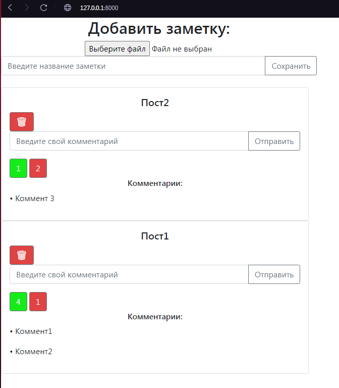
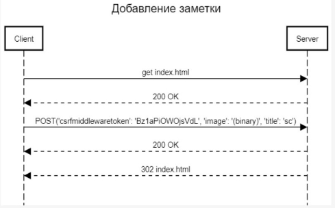
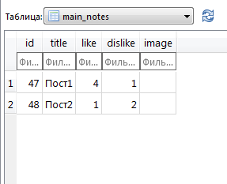
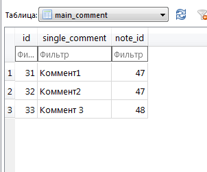

# **Лабораторная работа №2** 

1. **Цель работы:**

Разработать и реализовать клиент-серверную информационную систему, реализующую механизм CRUD.

1. **Основное задание:**

Спроектировать и разработать систему для анонимного общения в сети интернет. 

Интерфейс системы должен представлять собой веб-страницу с лентой заметок, отсортированных в обратном хронологическом порядке и форму добавления новой заметки. В ленте отображается последние 100 заметок. 

Возможности: 

1. Добавление текстовых заметок в общую ленту; 
1. Реагирование на чужие заметки (лайки, дизлайки); 
1. Добавление комментариев к заметкам;
1. Удаление комментариев.

# **1. Создание пользовательского интерфейса:**

** 
**

На сайте пользователю доступны следующие возможности: 

1. Добавление заметок, которые будут видны на сайте; 
1. Лайк/Дизлайк существующих заметок;
1. Добавление комментариев к каждой заметке;
1. Удаление заметок;

**4.   Описание API сервера и хореографии:**

` `Пример запроса при создании новой заметки в ленте:

Пример запроса при удалении заметки:

Пример запросов при добавлении лайка/дизлайка:

 

1. **Описание структуры базы данных:**

Для хранения данных в БД используется sqlite3. Имеются 2 таблицы: в первой таблице хранятся сами заметки, а также количество лайков и дизлайков:

Во второй таблице хранятся комментарии к заметкам. В каждой записи хранится содержание комментария и id поста, с которым он связан:

1. **Описание алгоритмов** 

` `Алгоритм действий пользователя:

